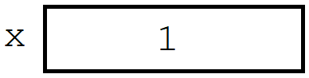
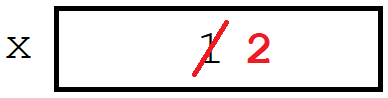

# Module Review

At this point, you've had several weeks to get familiar with HTML, CSS, and JavaScript.
The aim of this document is to review the programming concepts you've learned through the modules and lessons in a more formal manner.

## Functions

Functions are the basic building blocks of any programming language.
They are how we give the computer a command - how we tell it to *do* something.
There is a full list of JavaScript built-in functions [here](https://www.w3schools.com/jsref/jsref_obj_global.asp).
Many of our commands (like `alert`) are actually part of the Window object defined [here](https://www.w3schools.com/jsref/obj_window.asp).

The JavaScript function you're probably most familiar with is `alert()`.

#### `alert()`

[`alert()`](https://www.w3schools.com/jsref/met_win_alert.asp) is a function that takes one input and displays it to the screen.
For instance, this code will display `Hello, World!` to the user:

```js
alert('Hello, World!');
```

#### `prompt()`

[`input()`](https://www.w3schools.com/jsref/met_win_prompt.asp) is like a sibling to `alert()`.
It takes one input, which it displays to the screen, and then waits for the user to type a response (which it returns as an output).
For instance, this code will display `Say something:` to the user, wait for the user to type a response, and then store that response in a variable called `response`:

```js
response = prompt('Say something:');
```

#### `parseInt()`

[`parseInt()`](https://www.w3schools.com/jsref/jsref_parseint.asp) converts text or decimal numbers into an integer (a whole number).
This is especially useful in combination with `prompt()`, which always returns a string.
For example, the code below converts a string to a number and does basic math with it:

```js
// After the line below, x has a value of 7.
x = parseInt('5') + 2;
```

#### `parseFloat()`

[`parseFloat()`](https://www.w3schools.com/jsref/jsref_parsefloat.asp) is like `parseInt`, except it converts text to a decimal number.
This is necessary if you don't want the result to be rounded.
For example:

```js
// After the line below, x has a value of 4.55.
x = parseFloat('2.55') + 2;
```

#### String `.length`

[`.length`](https://www.w3schools.com/jsref/jsref_length_string.asp) is not a function - it is a *property* of a string.
It tells us the length of the string in question.
For example, the code below gets the length of the string `'Hello, World!'`:

```js
// After the lines below, x has a value of 13.
y = 'Hello, World!';
x = y.length;
```

### Libraries

Often we want to do more complex tasks that aren't covered in the "built-in functions", like generate a random number or get the current date.
For many of these tasks, there are existing "libraries" that we can use.

The most common library we have used is the [`Math`](https://www.w3schools.com/js/js_math.asp) object, which has several useful tools.

#### `Math.floor()`

[`Math.floor()`](https://www.w3schools.com/jsref/jsref_floor.asp) takes any number and rounds it down to the nearest (lower) integer.
This is very useful when combined with `Math.random()`.
For example, 1.9 gets rounded down to 1:

```js
// After the line below, x has a value of 1.
x = Math.floor(1.9);
```

#### `Math.random()`

[`Math.random()`](https://www.w3schools.com/js/js_random.asp), on its own, creates a random decimal number between 0 and 1.
This can be made more useful when multiplied and combined with `Math.floor()` to give us random whole numbers.
For example, the code below displays a random integer between 1 and 10:

```js
x = Math.floor(Math.random() * 10) + 1;
alert(x);
```

## Variables

Variables are a necessary piece to almost any program.
If functions are how we *do* something in a program, variables are how we *remember* things.

When you create a variable, you can think of it as creating a "box" in the computer's memory where it can store a single value.
As best practice, we use the keyword `var` whenever we "create" a new variable (e.g. if it doesn't exist already).
For example, the code below creates the variable `x` and stores the value `1` inside of it:



```js
var x = 1;
```

Programming variables are different from mathematical variables.
They simply store a value, and that value can be changed.
For instance, the following command would be impossible in math:



```js
// Increase x by 1, and store it back into x.
x = x + 1
```

### Variable types

Variables can be numbers (int or float), strings (text), Booleans (True/False), or a number of other unique types.
A full list of built-in types can be found [here](https://developer.mozilla.org/en-US/docs/Web/JavaScript/Data_structures).

JavaScript is a "dynamically typed" language, meaning that you don't have to define what kind of variable you're making when you create it.
For example, `x` can start as a number and change to a string:

```js
// The following lines of code are valid, and results in displaying 'Bob'.
var x = 5;
x = 'Bob';
alert(x);
```

### Arrays

In JavaScript, an [`array`](https://www.w3schools.com/js/js_arrays.asp) is a way of creating a collection of related values.
This can be useful when you want to "loop over" a set of items.
You can access each item using its "index", or position number.
For example, the code below creates a list of cars and displays the first, third, and last cars:

```js
// Notice counting starts from 0.
var cars = ['Lexus', 'Mazda', 'Toyota', 'Audi', 'Subaru', 'Porsche'];
alert(cars[0]);
alert(cars[2]);
alert(cars[cars.length - 1]);
```

## If statements

Another of the fundamental concepts in programming, an `if` statement lets you run a block of code *only if* a certain condition is met.
For example, the code below will display `Yay!` if the number `x` is greater than 10:

```js
var x = 1;
if (x > 10) {
    alert('Yay!');
} else if (x > 5) {
    alert('Almost there!');
} else {
    alert('Not quite!');
}
```

Note that each "test condition" is in **brackets ()**, and each "block" of code is in **curly braces {}**.
The braces tell JavaScript what code is attached to the `if` statement before it.
The statement `else if` essentially performs another if statement, but only if the first condition *wasn't* true.
`else` will run if none of the previous conditions were true.

## While loops

A loop is a way of repeating a block of code multiple times.
It is like an `if` statement - it has a condition that it checks, and it will only run its code if the condition is true.
Unlike an `if`, it will keep running its block of code until the condition isn't true, checking each time it finishes.
For example, the code below will display 1 to 9, then `Done!`:

```js
var x = 1;
while (x < 10) {
    alert(x);
    x = x + 1;
}
alert('Done!');
```

Like `if` statements, notice that the block of code performed by the `while` statement is all contained in curly braces.

## Comments

Comments are a way of writing human-readable descriptions of your code, for yourself and anyone else who may read your code in the future.
There are [two types of comments](https://www.w3schools.com/js/js_comments.asp) in JavaScript:

1. **Single-line:** Starts with a `//`, and describes the following block of code:

    ```js
    // Increase x by 1.
    x = x + 1
    ```

2. **Multi-line:** Starts with `/*`, ends with `*/`, and everything between is ignored:

    ```js
    /*
    Multi-line
    comment.
    */
    ```
