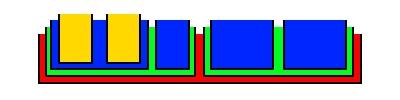

# html

It's time to take a closer look at the way we build websites: HTML.

HTML is not a programming language - it is a "markup" language (HTML stands for "Hyper Text Markup Language").
It is a way of formatting and presenting information.
It allows you to create objects ("elements") on a webpage - you can think of each element as a **container** that you can put other elements into (and in turn those elements can contain other elements, and so on).

[//]: # (Image source: https://commons.wikimedia.org/wiki/File:Floral_matryoshka_set_2_smallest_doll_nested.JPG)

### Containers

The most basic HTML element is called a `
`.
This is an empty container, which you can put any other objects inside.
This "groups" those objects so you can move them around on the page, apply a set of styles to them, and more.

### Text elements

There are also a number of text elements, like `<h1>` (Header 1) and `
` (Paragraph) that will style text in different ways (`<h1>` makes the text large and bold).
See [/resources/htmlGuide.html](/resources/htmlGuide.html) for more examples of text elements.

### More

There are HTML elements for images (``), videos (`<video>`), buttons (`<button>`), inputs (`<input>`), and more.
See the [W3Schools HTML Element Reference](https://www.w3schools.com/tags/) for a complete list!

## Exercise

1. Always start by opening Brackets, creating a new file, and saving it.

    - Save the new file as `helloHtml.html`.
    - Fill out the basic structure of the HTML from memory, or use a template or past project.

2. Open `htmlGuide.html` (from this course's resources folder) as a reference:

    - [htmlGuide source code](/resources/htmlGuide.html)
    - [htmlGuide in action](https://northcotehs.github.io/10DWEB/resources/htmlGuide.html)
    - Open both, and compare the code to the result!

3. Your task is to create *any* webpage you like, making sure you use at least one of each of these elements:

    - `<h1>`
    - `
`
    - `<a>` with an appropriate `href`
    - `<button>` (it doesn't have to "do" anything when clicked)
    - `<ul>` or `<ol>`, with `<li>` elements inside
    - `<select>`, with `<option>` elements inside
    - `<table>`, with `<tr>`, `<th>`, and `<td>` elements inside
    - group any elements that belong together by putting them into a `
`

4. For each element above, search the htmlGuide to see how it works before making your own!

5. The goal of this task is to learn the elements - your webpage doesn't have to make sense, and the elements don't need to be related to each other. But do make sure to put *some* text into every element that needs text!

Congratulations, you've now used many of the most common HTML elements!

## Resources

- [htmlGuide.html source code](/resources/htmlGuide.html)
- [htmlGuide.html live](https://northcotehs.github.io/10DWEB/resources/htmlGuide.html)
- [W3Schools](https://www.w3schools.com/html/)
- [Khan Academy](https://www.khanacademy.org/computing/computer-programming/html-css)
- [Codecademy](https://www.codecademy.com/learn/learn-html)
