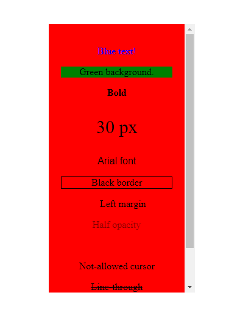

# css

Web programming isn't only about HTML - in fact, there are three main components to any "static" webpage:

1. **HTML:** The skeleton of your code, where you define your content, but *not* how it looks or behaves. This is like dragging elements from the "Palette" in App Inventor.
2. **CSS:** The styles where you define the appearance of your elements, much like changing the properties in the App Inventor "Designer".
3. **JavaScript:** The behaviour of your code. This is like the "Blocks Editor" in App Inventor.

In this task, you are going to begin learning how to **style** your webpages using **CSS**.

## Steps (Inline version)

1. Always start by opening Brackets, creating a new file, and saving it.

    - Save the new file as `helloCss.inline.html` (note the `.inline` part of the filename!).
    - Fill out the basic structure of the HTML from memory, or use a template or past project.

2. In the HTML body, create a div with a custom style: `<div style="background-color: red;"></div>`

    - Notice the syntax! We added an "attribute" to the element called `style`, by putting `style=""` inside the opening `<div>` statement.
    - Whenever you define an attribute (like style), the value of the attribute goes in quotes `""`.
    - In this case we have changed the div's `background-color` (notice it's the American spelling "color", not "colour") to blue.
    - We ended the style definition with a semicolon (`;`).

3. Inside the `<div>`, create a series of `<p>` elements with *any* text in them, and with the following styles:

    - `color: blue;` (Hint: Your result should look like `<p style="color: blue;">Blue text!</p>`)
    - `background-color: green;` (Notice how this interacts with the div's `background-color`)
    - `font-weight: bold;`
    - `font-size: 30px;`
    - `font-family: Arial, sans-serif;`
    - `border: 1px solid black;`
    - `margin-left: 20px;`
    - `display: none;` (Where did it go??)
    - `opacity: 0.5;`
    - `visibility: hidden;` (How is this different from `display: none;`?)
    - `cursor: not-allowed;` (Notice what happens to your mouse when you hover over!)
    - `text-decoration: line-through;`
    - `unicode-bidi: bidi-override; direction: rtl;` (Notice we're changing two styles at once)

4. Now modify your main div to have all of these styles (and also keep its red background):

    - (To change multiple styles at once, list all the changes in the **same** `style=""` statement, like `style="background-color: red; width: 100px;"`)
    - `width: 200px;`
    - `height: 400px;`
    - `padding: 20px;`
    - `text-align: center;`
    - `overflow-y: scroll;`
    - This has changed the size of the div and the layout of its content. With each style you add, look at your div and see how it changes!

5. Continue adding more styles to your div:

    - `position: absolute;`
    - `left: 80px;`
    - `top: 40px;`
    - This has moved your div on the screen!

That's it for the **inline version** of this task (but we're not all done)! It should look something like this:



Now we're going to take a couple steps to **improve** our CSS.

## Steps (Stylesheet version)

"Inline" CSS, where you use the `style=""` attribute directly in the HTML, is easy to learn but is **bad practice**:

- In web programming it is very important to separate the three pieces (content, style, and behaviour) - our styles do not belong in the HTML.
- By separating, we can easily change the styles on a page without having to touch the content (like different "skins" for an app).
- It also helps us avoid the huge `style=""` blocks like we have for our div above!

The alternative is a **stylesheet**, which we will look at now.

1. Make sure `helloCss.inline.html` is saved (Ctrl-S or Cmd-S), then click File -> Save As, and save the new version as `helloCss.html` (no `.inline`!).

2. In your HTML `<head>` block (which is probably empty, or might contain a `<title>` block), add a new block:

    ```
    <head>
        <style type="text/css">
        </style>
    </head>
    ```

3. Back in your HTML body, give your main div (with the red background) an id attribute with the value "main":

    ```
    <div id="main" style="...">
        ...
    </div>
    ```
    - This "id" is a unique identifier - if we call it "main", nothing else on the page is allowed to have that id.
    - We can use it to "select" that element and apply styles to it in our stylesheet!

4. Return to your stylesheet that you made in Step 3. Add the following definition:

    ```
    <head>
        <style type="text/css">
            #main {
                background-color: red;
            }
        </style>
    </head>
    ```
    - Note that `#main` is called a "selector". the `#` symbol tells CSS to select the element with the given **id**. There are other selectors for other purposes.

5. Copy and delete (or "cut") the `style=""` attribute from your div, and paste it into the `#main` style we have begun creating. Each style declaration (ending with a semicolon) should be on a new line.

6. Congratulations! You've begun using stylesheets, and you're done `helloCss.html`.

## Extension

1. Look up [how to use "classes" with CSS](https://www.w3schools.com/cssref/sel_class.asp).
2. Give each of your `<p>` tags an appropriate class name (names should be short and descriptive, and begin with a lower-case letter).
3. Using the classes and the class selector (`.my-class`), move each of their styles to the stylesheet.

If you're attempting the extension, refer to [this example](https://www.w3schools.com/cssref/tryit.asp?filename=trycss_cursor) for assistance.

## Resources

[List of CSS Properties](https://www.w3schools.com/cssref/)
