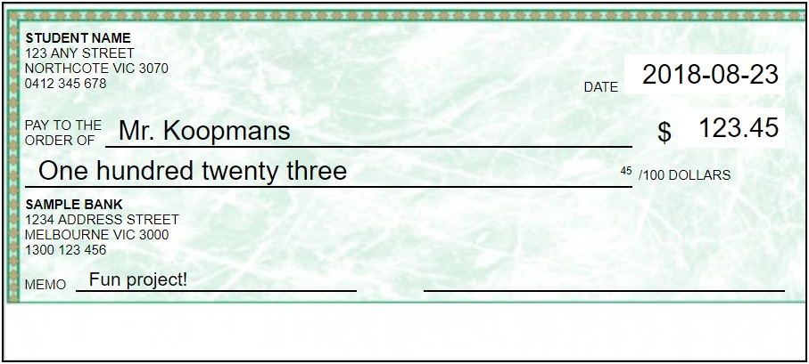

# cheque

Before the modern age of Internet payments, one common form of payment was the cheque - an official paper on which you wrote the amount you wanted to pay someone, and then signed. In fact, in Canada (the Koopmans' home and native land), cheques are still the standard way to pay rent (Australia uses BPAY online transfers).

Your task is to use HTML and CSS to create a realistic reproduction of a cheque.

[//]: # (Image source: http://torontostamps.com/personalcheque.html)

## Steps

1. Before attempting this task, you should first complete [helloHtml](../2_helloHtml/) and [helloCss](../3_helloCss/).

2. Always start by opening Brackets, creating a new file, and saving it.

    - Save the new file as `cheque.html`.
    - Fill out the basic structure of the HTML from memory, or use a template or past project.

3. Create the HTML contents of the cheque, *ignoring* styling for now. You should have:

    - a `
` container for the cheque
    - separate `
` elements for each bit of text
    - ids on each element

4. Once the content is created, you can modify each element's style using CSS. Create a `<style>` block in your `<head>`, and use the ids to add styles:

    - `position: absolute;` on the `
` and all `
`s
    - width, height, and border for the cheque (should be 602px by 270px)
    - left, top, width, and height for each text
    - some text may need borders or underlining

5. Use the [positionAbsolute.html](./positionAbsolute.html) example (in this folder) for help with using `position: absolute;` and related styles.

6. You may use [chequeBackground.jpg](./chequeBackground.jpg) as a background image if you like.

7. Try to get your cheque to look as close as possible to the original! Here's an example (created in HTML/CSS):

[//]: # (Background source: https://www.chequeprint.ca/wp-content/uploads/2015/03/Premium_BLANK_Green_Stock_Cheque_Print-600x246.jpg)

## Assessment

- **Note:** all code should be commented and you should have no redundant code.

Remember to commit each time you've made a major change to your code, and to push to GitHub frequently.
