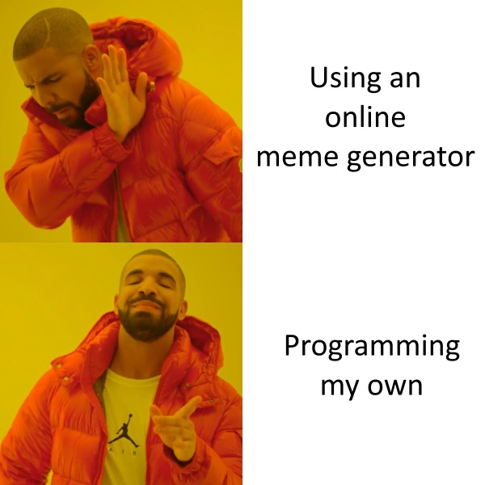

# memeGen

Memes: Why not?

There are lots of "meme generators" out there that will provide an image and template, and you just have to enter your text.
Usually these will add a watermark to the result, unless you pay money.

Your task is to make your own generator!

## Steps

1. Before attempting this task, you should first complete [helloHtml](../2_helloHtml/) and [helloCss](../3_helloCss/).

2. Always start by opening Brackets, creating a new file, and saving it.

    - Save the new file as `memeGen.html`.
    - Fill out the basic structure of the HTML from memory, or use a template or past project.

3. Pick your favourite meme, download the source image, and put it in the same folder as your project.

4. Create an image element using the meme as its `src`, and style it to the right size.

5. Create text elements (`
`? `<h1>`? your choice!) and use the `position: absolute` style to put them where you want on the image.

    - See the [positionAbsolute.html](./positionAbsolute.html) for an example of absolute position!

6. Get the text from the user, using `<input>` or `prompt()`.

7. Update the text elements' contents using `.innerHTML`.

8. Use the resources below to guide you through the process.

## Resources

| Concept              | Resource |
|----------------------|----------|
| Images      | <ul><li>[HTML image element](https://www.w3schools.com/tags/tag_img.asp)</li></ul> |
| Height/Width  | <ul><li>[CSS Height and width](https://www.w3schools.com/css/css_dimension.asp)</li></ul> |
| Position      | <ul><li>[Position property (W3Schools)](https://www.w3schools.com/cssref/pr_class_position.asp)</li><li>[CSS layout - position (W3Schools)](https://www.w3schools.com/css/css_positioning.asp)</li></ul> |
| Displaying results   | <ul><li>[JavaScript output summary (W3Schools)](https://www.w3schools.com/js/js_output.asp)</li><li>[Changing HTML content](https://www.w3schools.com/js/js_htmldom_html.asp)</li></ul> |
| CSS Summary   | <ul><li>[List of CSS Properties](https://www.w3schools.com/cssref/)</li></ul> |
| General     | <ul><li>[StackOverflow](https://stackoverflow.com/)</li><li>[W3Schools](https://www.w3schools.com/)</li><li>[CSS-Tricks](https://css-tricks.com/)</li><li>[Course Resources](/resources/)</li></ul> |

For HTML versions (using `<input>`, buttons, and `.innerHTML`):

| Concept              | Resource |
|----------------------|----------|
| Input elements | <ul><li>[Different input types (W3Schools)](https://www.w3schools.com/tags/att_input_type.asp)</li></ul> |
| Buttons     | <ul><li>[HTML button element](https://www.w3schools.com/tags/tag_button.asp)</li><li>[Button onclick event (linking to functions)](https://www.w3schools.com/jsref/event_onclick.asp)</li></ul> |
| Getting HTML content | <ul><li>[getElementById() (W3Schools)](https://www.w3schools.com/jsref/met_document_getelementbyid.asp)</li><li>[Input text value property (W3Schools)](https://www.w3schools.com/jsref/prop_text_value.asp)</li><li>[Getting dropdown selection value (W3Schools)](https://www.w3schools.com/jsref/prop_select_value.asp)</li></ul> |

## Extension

- Allow special styling on the text (colour, outline, font, etc).
- Let the user choose between multiple meme templates.
- Use animated meme templates (gifs).
- Allow timed captioning for movie clips etc.
- Save the completed meme as an image.
    - This is complicated - requires HTML5 `<canvas>` element and JS `FileSaver` library!
- Do something else creative!

## Assessment

| Level  | Expectations |
|--------|--------------|
| Bronze | Suitable meme image with user-defined text. |
| Silver | Special styling and multiple templates. |
| Gold   | Ability to save meme as an image file. |

- **Note:** all code should be commented and you should have no redundant code.

Remember to commit each time you've made a major change to your code, and to push to GitHub frequently.
