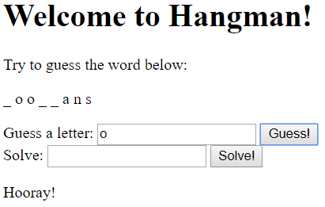

# hangman

Hangman is a game where someone thinks of a word and you need to guess it, one letter at a time.
You start out with a series of blank spaces, and when you guess a correct letter those letters get filled in.

If you fill in all the blanks (or guess the entire word), you win!
But each time you guess a wrong letter, you get a strike, often drawn as a stick figure being "hanged".
If you get too many strikes, you lose.

Your task is to create a hangman game.

#### Example:

In the example:
    - Guessing a correct letter displays "Hooray" and updates the word above.
    - Guessing a wrong answer displays "Boo! Strike 1" (or however many strikes have occurred).
    - Solving the word correctly displays "Correct! Congratulations! You had [X] strikes." (filling in the number of strikes).

## Steps

1. Always start by opening Brackets, creating a new file, and saving it.

    - Save the new file as `hangman.html`.
    - Fill out the basic structure of the HTML from memory, or use a template or past project.

2. In JavaScript, create an array of at least 10 words for your program to choose from.

3. Randomly select one of the words from the list to be the game word (Hint: you will need to use `Math.random()`, think of the `magic8` program).

4. Determine the length of the word and display the appropriate number of blanks (you could use * or _ to represent the blanks).

    - You might use `alert()` or use HTML to display directly on the webpage.

5. Get the user to guess a letter, either with `prompt()` or an HTML `<input>` and `<button>`.

6. Check if each letter in the word matches the guess.

    - If a letter matches, update the letter in the display from a blank to the matching letter (e.g. `_____a__`).
        - This is the trickiest part of this program! Think about how you can store/display the blanks and correct letters.
    - If there were any matches, display `Hooray!`
    - If there were no matches, increase a "strikes" counter and tell the user the guess was wrong.

7. Repeat steps 5-6 until all letters have been guessed, or the user has hit the maximum # of strikes (i.e. 5, or your choice).

8. Use the resources below to guide you through the process.

## Resources

| Requirement | Resource |
|-------------|----------|
| Arrays               | <ul><li>[JavaScript arrays](https://www.w3schools.com/js/js_arrays.asp) (look at "Creating" and "Access the Elements")</li></ul> |
| Random values        | <ul><li>[JavaScript random](https://www.w3schools.com/js/js_random.asp) (in particular, "random integers")</li><li>getting a random array value - try [Google](https://www.google.com.au/)!</li></ul> |
| Loops                | <ul><li>[JS while loop](https://www.w3schools.com/js/js_loop_while.asp)</li><li>[JS for loop](https://www.w3schools.com/js/js_loop_for.asp)</li><li>[Looping through each character in a string (StackOverflow)](https://stackoverflow.com/a/1967132/4080966)</li></ul> |
| String manipulation  | <ul><li>[JS Operators (scroll to "string operators")](https://www.w3schools.com/js/js_operators.asp)</li><li>[String concatenation (or simply use `str1 + str2`)](https://www.w3schools.com/jsref/jsref_concat_string.asp)</li><li>[JS string methods (W3Schools)](https://www.w3schools.com/js/js_string_methods.asp)</li></ul> |
| General     | <ul><li>[StackOverflow](https://stackoverflow.com/)</li><li>[W3Schools](https://www.w3schools.com/)</li><li>[CSS-Tricks](https://css-tricks.com/)</li><li>[Course Resources](/resources/)</li></ul> |

For HTML versions (using `<input>`, buttons, and `.innerHTML`):

| Concept              | Resource |
|----------------------|----------|
| Input elements | <ul><li>[Different input types (W3Schools)](https://www.w3schools.com/tags/att_input_type.asp)</li></ul> |
| Buttons     | <ul><li>[HTML button element](https://www.w3schools.com/tags/tag_button.asp)</li><li>[Button onclick event (linking to functions)](https://www.w3schools.com/jsref/event_onclick.asp)</li></ul> |
| Getting HTML content | <ul><li>[getElementById() (W3Schools)](https://www.w3schools.com/jsref/met_document_getelementbyid.asp)</li><li>[Input text value property (W3Schools)](https://www.w3schools.com/jsref/prop_text_value.asp)</li><li>[Getting dropdown selection value (W3Schools)](https://www.w3schools.com/jsref/prop_select_value.asp)</li></ul> |
| Displaying results   | <ul><li>[JavaScript output summary (W3Schools)](https://www.w3schools.com/js/js_output.asp)</li><li>Option 1: [JS alert box](https://www.w3schools.com/js/js_popup.asp)</li><li>Option 2: [Changing HTML content](https://www.w3schools.com/js/js_htmldom_html.asp)</li><li>Option 3: [console.log](https://www.w3schools.com/jsref/met_console_log.asp)</li></ul> |

## Extension

- Let a second player set the words, but clear the output so the first player won't see the word on the screen! Keep score.
- Allow for phrases with multiple words. Leave spaces between the blanks so the use knows how long each word is.
- Display a proper hangman image, adding an extra "limb" with each wrong guess.
- Do something else creative!

## Assessment

| Level  | Expectations |
|--------|--------------|
| Bronze   | Chooses a random word and allows the user to guess letters. Keeps track of strikes. |
| Silver   | Allows user to guess answer early. Player loses if they earn too many strikes. Game is replayable |
| Gold     | Implements one or more of the challenges. |

- **Note:** all code should be commented and you should have no redundant code.

Remember to commit each time you've made a major change to your code, and to push to GitHub frequently.
