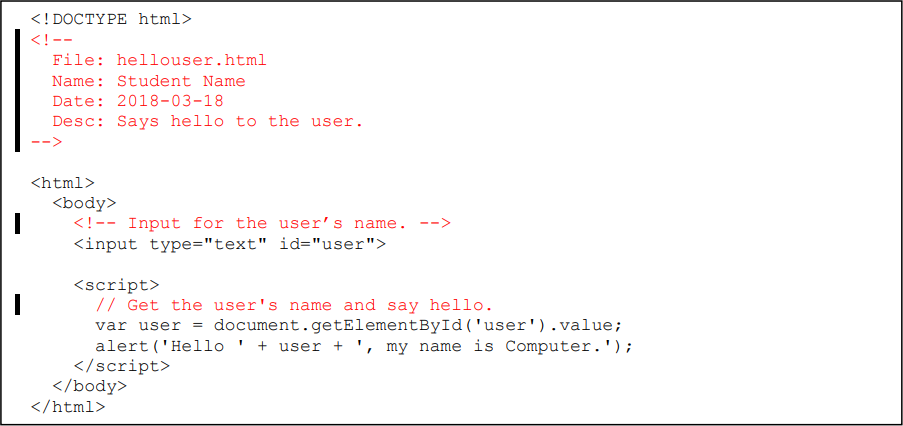
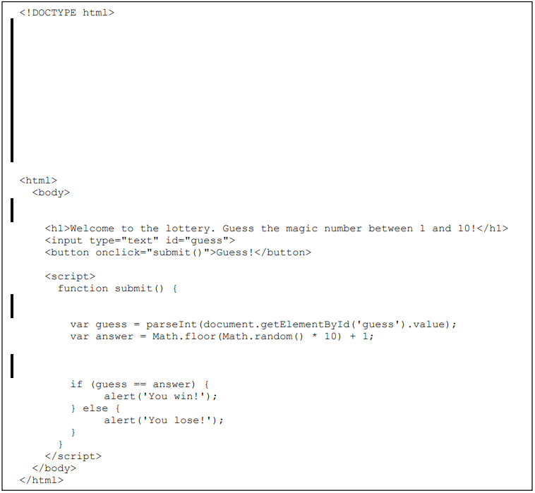

# commenting

Comments are a way of writing human-readable descriptions of your code, for yourself and anyone else who may read your code in the future.
These lines are specifically *ignored* by the computer when running your code.
They are vital not only after-the-fact, but also in structuring your thinking while you program.
**Every** program you write should have thorough comments.

In web programming, we need to know how to write comments in each of our three languages (HTML, CSS, and JS):

1. **HTML:** Starts with `<!--` and ends with `-->`. This can span any number of lines - everything between the start and end is commented.

2. **CSS:** Starts with `/*` and ends with `*/`. This can also span any number of lines.

3. **JS:** There are two types of JavaScript comments:

  - Single-line: Everything after `//` is ignored, until the end of that line of text.
  - Multi-line: Starts with `/*` and ends with `*/` (just like CSS).

In all contexts, comments should be written **as sentences**, starting with a capital letter and ending with a period.
They should also be written as if they are "commands", e.g. `// Get the current date.` (good), not `// Gets the current date.` (bad).

#### Demonstration

In the code below, there is an example of each type of comment:

```html
<!DOCTYPE html>
<!--
  Header comment (HTML):
  Briefly describe the entire file, in broad terms,
  over multiple lines. Comes immediately after <!DOCTYPE>.
-->

<html>
  <head>
    <style type="text/css">
      /* CSS comment: Describe the following styles. */
      body {
        background-color: blue;
      }
    </style>
  </head>
  <body>
    <!-- HTML comment: Describe the following block of HTML elements. -->
    <h1>Hello, world!</h1>
    <p>This is some text.</p>

    <script>
      /* Multi-line JS comment:
         For long descriptions over multiple lines.
      */

      // JS comment: Describe the following block of code.
      var x = 1;
      x = x + 1.05;   // JS comment: Describe something unique on this line.
      console.log(x);

      // Another JS comment.
      var y = 2;
      console.log(y);
    </script>
  </body>
</html>
```

#### Removing code

Note that comments can also be used to temporarily remove code, like below:

```js
// Set the difficulty of the game.
// var difficulty = 'hard';
var difficulty = 'easy';
```

## Paper exercises

You will be given paper exercises to test your ability to use comments and your understanding when reading code excerpts.
These exercises will **always** require you to:

1. Add a *header comment* to the top of the excerpt, immediately after `<!DOCTYPE>`, with the following layout (replace `[...]` with the appropriate information):

    ```html
    <!DOCTYPE html>
    <!--
      File: [program name.html]
      Name: [Your Name]
      Date: [Date the program was written]
      Desc: [Brief, 1-sentence description.]
    -->
    ```

2. Add one or more comments at the lines indicated with black "gutter marks".

    - These should describe the block of code that *follows* them.

## Examples

For each code excerpt below, read the code and add appropriate comments.
In the header comment, use your own name as the author, provide your own description of the code, and use the filename and date provided.

1. `hellouser.html` (March 18, 2018):

    

2. `lottery.html` (March 18, 2018):

    
