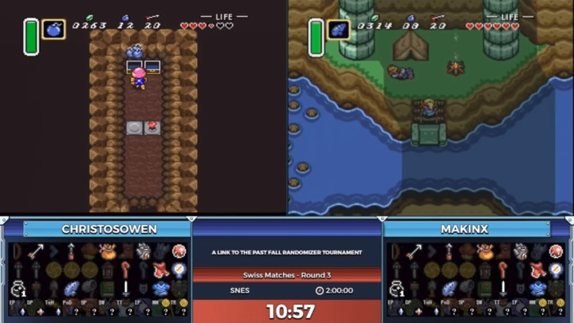
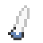

# alttpRando

[The Legend of Zelda: A Link to the Past](https://en.wikipedia.org/wiki/The_Legend_of_Zelda:_A_Link_to_the_Past) was one of the most popular games made for the Nintendo SNES. It was released in 1991-92 but is still played in tournaments today.

One of the most creative adaptations of the game is the ["ALttP Randomiser"](https://alttpr.com/), which takes the original game but shuffles the location of every item. In Zelda games, you unlock access to different parts of the world by acquiring new items. If those items are in random locations, it makes each play-through new and unique.

Your task is to program the *logic* behind this randomiser. You will be given all the information you need below.

## Steps

1. Do some research! [This tournament match](https://www.youtube.com/watch?v=ITpmGZGeCTo#t=11m31s) is a great entry point - the commentators do a good job of explaining what the game is all about.

    - In the link above, the useful commentary starts at 11:31, the match itself begins at 13:16, and it lasts a bit under 2 hours. You don't need to watch the whole thing!
    - There is also a second match in that clip, and there are thousands of other matches available on YouTube and Twitch (see [SpeedGaming](https://www.youtube.com/channel/UC-lm_blkZ_ujmRSwYcJY2ow) on YouTube)

2. Use the information below to create one of:

    - A "tracker" which lets you indicate what items you've found, and tells you which items are available to you. [Example here](https://crossproduct42.github.io/alttprandohelper/tracker.html?mode=open&map).
    - A "seed generator" which assigns the location of each item, following the rules below and ensuring it is possible to complete the game (finish Ganon's Tower, which requires completing the 7 crystals). *This is the harder option.*

3. Start simple - e.g. ignore the zone requirements to begin with.

4. Try to develop a creative solution - one of the hardest steps will be *representing* all of the information and requirements. Try to avoid using 100+ if statements - it will become very difficult to manage. There is always a more elegant solution.

## Information

There is a *lot* of information to handle for this project:

- **Items:** There are 27 items that may be required to complete the game, all other items can be considered "junk".
- **Areas:** There are 9 separate areas in the world that have different requirements to access.
- **Encounters:** There is one boss fight you can do that opens up additional routes around the world.
- **Dungeons:** There are 11 dungeons in the game. To beat the game, you must complete Ganon's Tower. To access Ganon's Tower, you must complete all 7 "Crystal" dungeons, which are randomly chosen from the other 10 dungeons each game. Each dungeon has a different number of item locations inside.
- **Locations:** Every item in the game is either in a dungeon or in the "overworld". All the overworld locations are listed, with the requirements to access.

Note that every location has a zone and requirements - to get the item, you must be able to access that zone *and* have all the other requirements. The logic is often complicated, with ands and ors.

#### Items
| Item | Image |
|------|-------|
| Fighter Sword |  |
| Master Sword |  |
| Moon Pearl |  |
| Bow |  |
| Silver Arrows |  |
| Hookshot |  |
| Mushroom |  |
| Magic Powder |  |
| Fire Rod |  |
| Ice Rod |  |
| Bombos Medallion |  |
| Ether Medallion |  |
| Quake Medallion |  |
| Lantern |  |
| Hammer |  |
| Shovel |  |
| Book of Mudora |  |
| Bottle |  |
| Cane of Somaria |  |
| Cane of Byrna |  |
| Magic Cape |  |
| Magic Mirror |  |
| Pegasus Boots |  |
| Power Glove |  |
| Titan's Mitt |  |
| Zora's Flippers |  |
| Flute |  |

#### Areas
| Area | Code | Requirements |
|------|-------|--------------|
| Light World | light |  |
| Death Mountain - Left | mount_left | (   or ) |
| Death Mountain - Top | mount_top | mount_left ( or   ) |
| Death Mountain - Right | mount_right | mount_left ( or   ) |
| Death Mountain - Dark World | mount_dark | mount_right    |
| Dark World - North | dark_north |  ( or    or agahnim  ( or  or )) |
| Dark World - South | dark_south |  (dark_north or agahnim  ) |
| Dark World - East | dark_east |  (agahnim or    or   ) |
| Misery Mire Area | mire_zone |    |

#### Encounters
| Encounter | Code | Requirements |
|-----------|-------|--------------|
| Agahnim | agahnim |  ( or   ) |

#### Dungeons
| Dungeon | # of Items | Zone | Entry Requirements | Completion Requirements |
|---------|------------|------|--------------------|-------------------------|
| Eastern Palace | 3 | light |  |    |
| Desert Palace | 2 | light | ( or mire_zone  ) |   ( or ) |
| Tower of Hera | 2 | mount_top |  | ( or ) |
| Palace of Darkness | 5 | dark_east |  |     |
| Swamp Palace | 6 | dark_south |    |    |
| Skull Woods | 2 | dark_north |  |   |
| Thieves' Town | 4 | dark_north |  |   |
| Ice Palace | 3 | dark_east |   ( or   ) |  ( or ) |
| Misery Mire | 2 | mire_zone | ( or ) |    |
| Turtle Rock | 5 | mount_dark |     |     |
| Ganon's Tower | 20 | mount_dark | all_crystals  |         |

#### Locations
| Location | # of Items | Zone | Requirements |
|----------|------------|------|--------------|
| Master Sword Pedestal | 1 | light | pendant0 pendant1 pendant2  |
| Mushroom | 1 | light |  |
| Forest Hideout | 1 | light |  |
| Lumberjack Tree | 1 | light | agahnim   |
| Lost Old Man | 1 | mount_left |   |
| Spectacle Rock Cave | 1 | mount_left |  |
| Spectacle Rock | 1 | mount_left |   |
| Ether Tablet | 1 | mount_top |    |
| Paradox Cave | 7 | mount_right |  |
| Spiral Cave | 1 | mount_right |  |
| Floating Island | 1 | mount_dark |   |
| Mimic Cave | 1 | turtle |   |
| Pegasus Rocks | 1 | light |   |
| Graveyard Ledge Cave | 1 | dark_north |   |
| King's Tomb | 1 | dark_north |  ( or ) |
| Witch | 1 | light |   |
| Waterfall of Wishing | 2 | light |   |
| King Zora | 1 | light | ( or ) |
| Zora River Ledge | 1 | light |   |
| Kakariko Well | 5 | light |  |
| Blind's Hideout | 5 | light |  |
| Bottle Vendor | 1 | light |  |
| Chicken House | 1 | light |  |
| Sick Kid | 1 | light |   |
| Tavern | 1 | light |  |
| Blacksmith | 1 | light |    |
| Magic Bat | 1 | light |  ( or    ) |
| Sahasrahla's Hut | 3 | light |  |
| Sahasrahla | 1 | light | pendant0  |
| Race Minigame | 1 | light |  |
| Library | 1 | light |   |
| Grove | 1 | light |   |
| Desert West Ledge | 1 | light | ( or mire_zone  ) |
| Checkerboard Cave | 1 | mire_zone |   |
| Aginah's Cave | 1 | light |  |
| Bombos Tablet | 1 | dark_south |     |
| Cave 45 | 1 | dark_south |   |
| Light World Swamp | 2 | light |  |
| Minimoldorm Cave | 5 | light |  |
| Ice Rod Cave | 1 | light |  |
| Lake Hylia Island | 1 | light |    (dark_south or dark_east) |
| Hobo | 1 | light |   |
| Link's House | 1 | light |  |
| Castle Secret Entrance | 2 | light |  |
| Hyrule Castle Dungeon | 3 | light |  |
| Escape Sewer Dark Room | 1 | light |   |
| Escape Sewer Side Room | 3 | light | ( or ) |
| Sanctuary | 1 | light |  |
| Bumper Cave | 1 | dark_north |    |
| Spike Cave | 1 | mount_left |    ( or ) |
| Superbunny Cave | 2 | mount_dark |  |
| Hookshot Cave (Top) | 3 | mount_dark |   |
| Hookshot Cave (Bottom) | 1 | mount_dark | ( or ) |
| Catfish | 1 | dark_east |   |
| Treasure Chest Minigame | 1 | dark_north |  |
| C House | 1 | dark_north |  |
| Bombable Hut | 1 | dark_north |  |
| Purple Chest | 1 | dark_north |   |
| Hammer Pegs | 1 | dark_north |    |
| Pyramid Fairy | 2 | dark_south | crystal5 crystal6 ( or agahnim  ) |
| Pyramid | 1 | dark_east |  |
| Digging Game | 1 | dark_south |  |
| Stumpy | 1 | dark_south |  |
| Hype Cave | 5 | dark_south |  |
| Mire Shed | 2 | mire_zone |  |

## More resources

- [Overworld items guide](https://maplequeensaku.weebly.com/news/legend-of-zelda-a-link-to-the-past-randomizer-overworld-item-locations-guide)
- [Dungeon items guide](https://maplequeensaku.weebly.com/news/legend-of-zelda-a-link-to-the-past-randomizer-dungeon-item-locations-guide)
- [Dungeon requirements guide](https://maplequeensaku.weebly.com/news/what-items-you-need-to-clear-dungeons-in-a-link-to-the-past-randomizer)
